# Jarvis Dashboard

A self-hosted homelab dashboard that combines infrastructure monitoring, container management, media discovery, and automated downloads into a single interface.

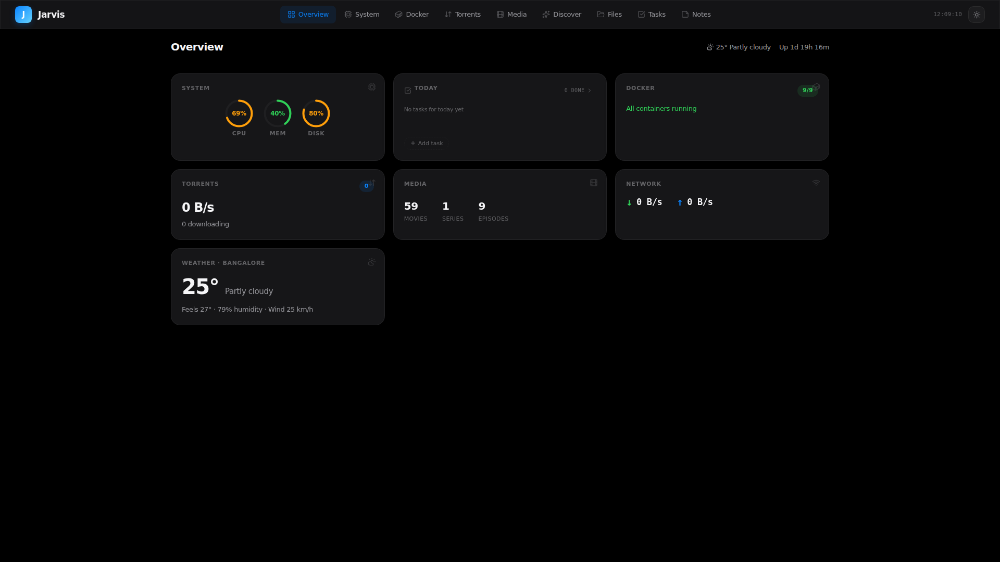

---

## Features

### Media Discovery & Downloads

Jarvis integrates a recommendation engine directly into the dashboard. Browse by mood, search by title, get personalized suggestions from your Jellyfin library, or explore what's trending — then download anything with one click through the built-in torrent client.

**Discover** — Four modes to find content:

| Mode | Description |
|------|-------------|
| **By Mood** | 12 mood categories powered by curated community data and TMDB |
| **Similar To** | Title search with autocomplete, returns TMDB recommendations |
| **From Library** | Analyzes your Jellyfin collection and suggests new titles based on your taste, with type and genre filters |
| **Trending** | TMDB trending movies and series, filterable by time window and media type |

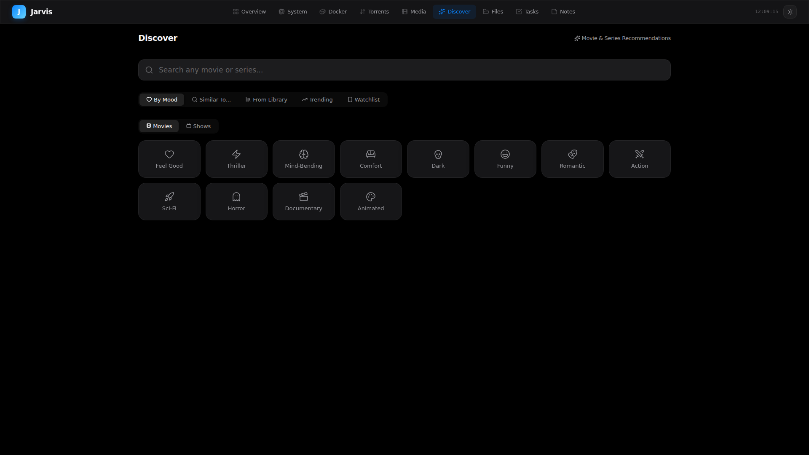

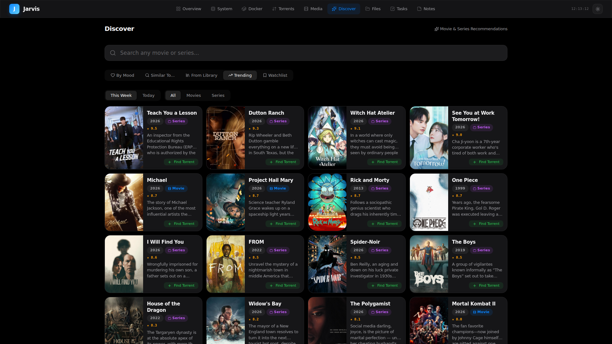

**Detail Pages** — Full TMDB metadata with poster, backdrop, synopsis, cast, ratings, and related titles. Breadcrumb navigation throughout.

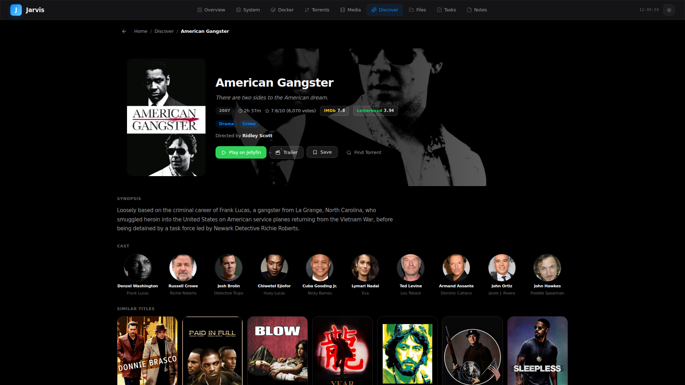

**Torrent Integration** — Every recommendation includes a "Find Torrent" button that searches available sources and adds directly to your torrent client (Transmission or qBittorrent).

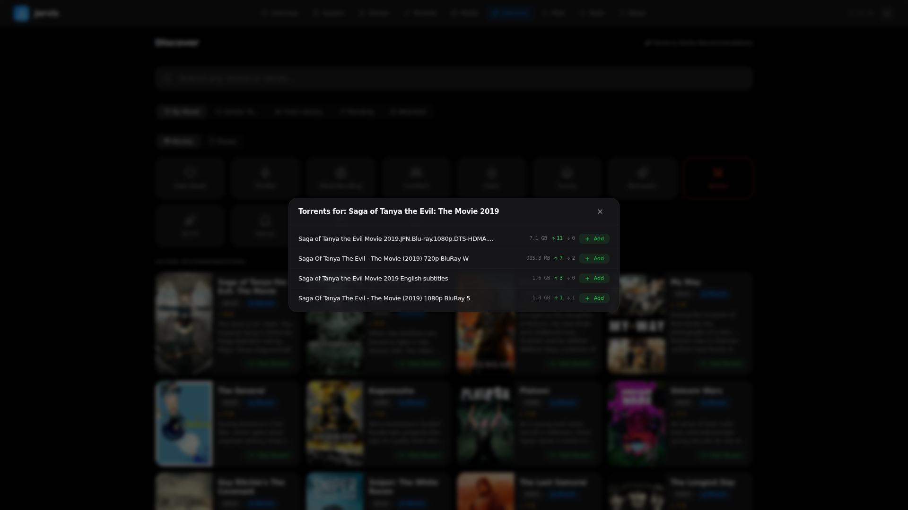

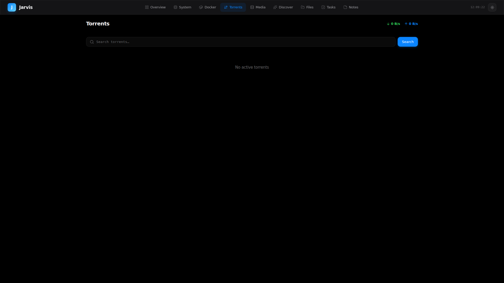

### Infrastructure Monitoring

Real-time CPU, RAM, and disk usage. 30-minute bandwidth history. Top processes by resource consumption. Storage breakdown by directory.

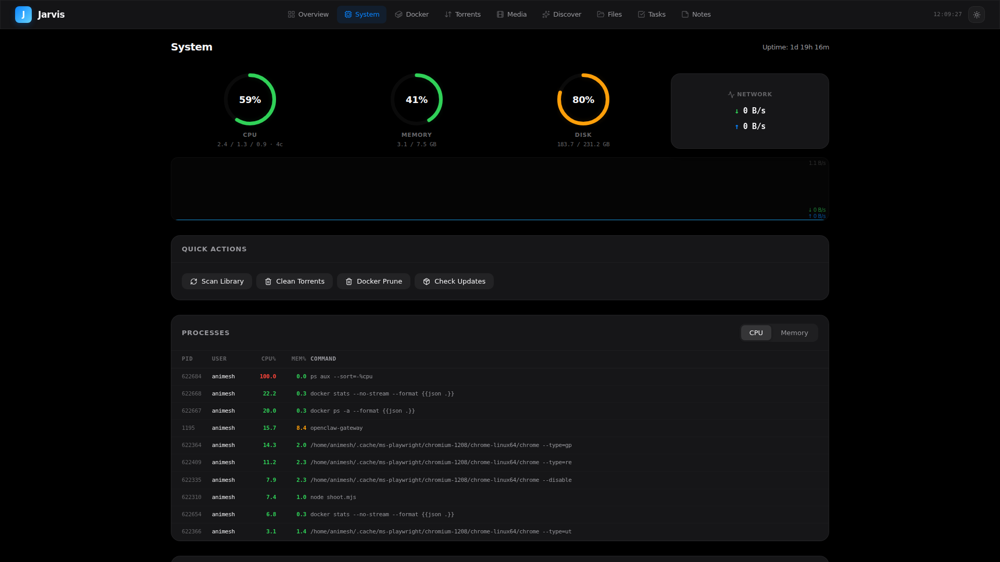

### Docker Management

Container overview with status indicators and resource bars. Start, stop, restart any container. Live log viewer.

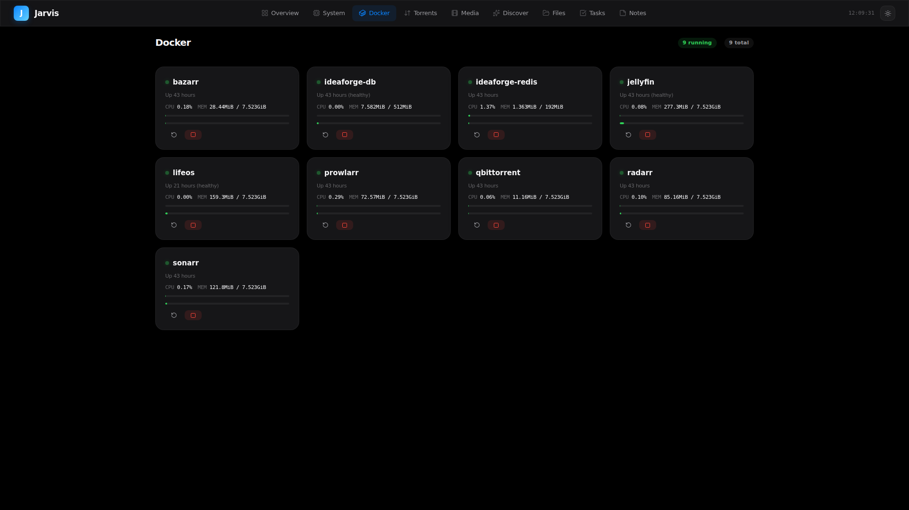

### Jellyfin Media Library

Library statistics, recently added items, and active streaming sessions.

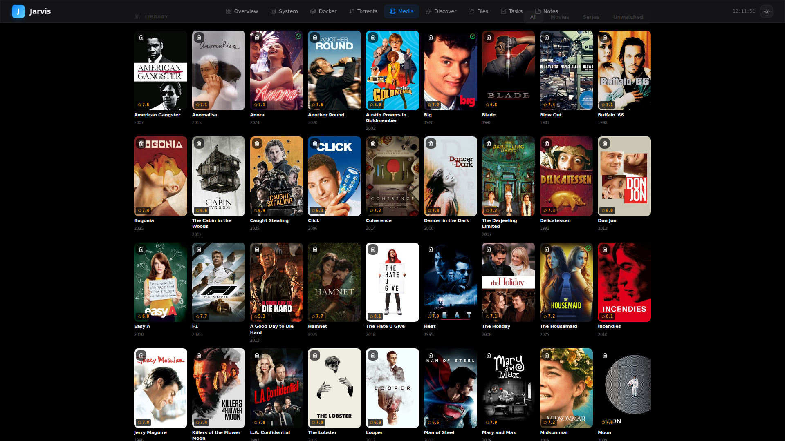

### File Explorer

Filesystem browser with breadcrumb navigation. Supports rename, copy, move, delete, and download operations.

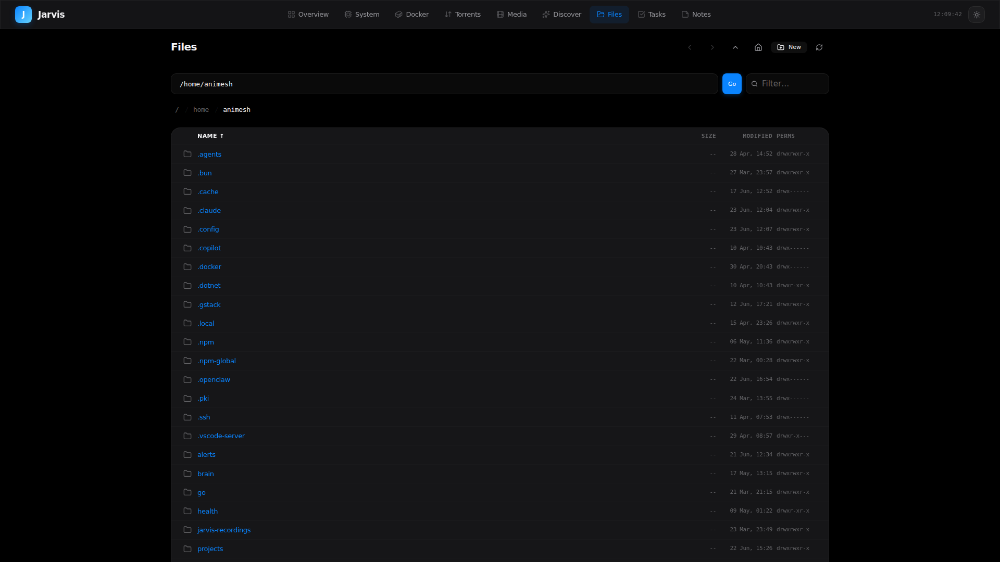

### Tasks

A kanban (Todo / In Progress / Done) with a calendar date picker. Drag-and-drop reordering, per-day views, and any incomplete task automatically rolls forward to today on first load — no orphaned cards from yesterday.

What makes it homelab-aware: type `{{` in any task title to autocomplete a movie or TV series via TMDB. Once linked, the card grows contextual buttons:

- **Play** — if the title is already in your Jellyfin library, opens it in the web player on whatever host you're connected through (`jackal:8096`, `192.168.0.x:8096`, etc.)
- **Get** — if it isn't, opens the same torrent search modal used on the Discover detail page, prefilled with the right query (`Title S01 complete` for series)
- **Info** — opens the full Discover detail page

Tasks are stored in `backend/tasks.json` (gitignored).

### Notes

Tagged notes with a two-pane editor (list on the left, editor on the right). Search across title and body, filter by tag, pin to top. Auto-save after 600 ms of idle, with a small "Saving… / Unsaved" indicator in the page header. Backed by a single `backend/notes.json` (gitignored).

### Today on the Overview

The Overview page shows a "Today" card alongside the system gauges — top incomplete tasks for the day with a checkbox to mark done and an inline `Add task` field. Click-through to the full kanban for the rest. Hidden when the `tasks` feature is disabled.

### Theming

Dark and light modes with system preference detection.

| Dark | Light |
|------|-------|
|  | 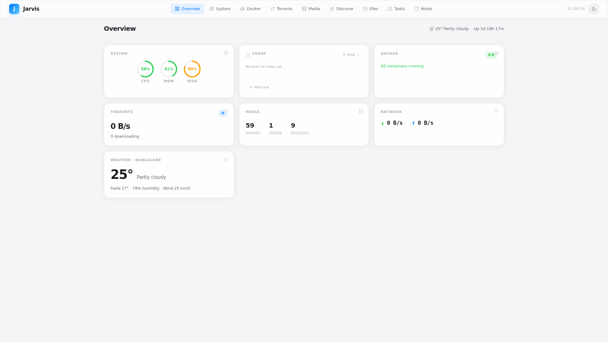 |

---

## Architecture

```
Browser ──→ Next.js (3000) ──→ Python Backend (8002) ──┬──→ Docker CLI
                                                        ├──→ Jellyfin API (8096)
                                                        ├──→ Transmission / qBittorrent
                                                        ├──→ TMDB API
                                                        ├──→ Reddit Wiki
                                                        └──→ System (/proc, du, etc.)
```

| Layer | Stack |
|-------|-------|
| Frontend | Next.js 16, React 19, TypeScript, SCSS Modules |
| Backend | FastAPI, Pydantic, httpx, uvicorn |
| Icons | Lucide React |
| Theme | CSS custom properties, localStorage |
| Data Sources | TMDB, Jellyfin, Transmission/qBittorrent, Docker, Reddit Wiki, wttr.in |

The backend follows a standard FastAPI project structure — routers for each API group, service modules for business logic, and Pydantic settings for configuration. Auto-generated API documentation is available at `/docs`.

---

## Getting Started

### One command

```bash
git clone https://github.com/Animesh98/jarvis-dashboard.git
cd jarvis-dashboard
./setup.sh run          # interactive setup + native launch
# or
./setup.sh run docker   # interactive setup + docker compose up
```

`./setup.sh` walks you through picking which features to enable (Discover is always on; Docker, Torrents, Media, System, Files, Tasks, Notes are opt-in), collects only the credentials those features need, and writes `.env`. Re-running is safe — existing values become the defaults.

Open `http://localhost:3000`. API docs at `http://localhost:8002/docs`.

### Just configure (no launch)

```bash
./setup.sh              # writes .env only
```

### Manual (bare metal)

If you'd rather skip the CLI:

```bash
cp .env.example .env
# Edit .env with your keys (see Configuration below)

cd backend
python3 -m venv venv && source venv/bin/activate
pip install -r requirements.txt
uvicorn app.main:app --host 0.0.0.0 --port 8002 &

cd ../frontend && npm install && npm run build && npm start
```

### Configuration

`./setup.sh` writes this for you. If editing by hand, copy `.env.example` to `.env` and set:

| Variable | Required | Description |
|----------|----------|-------------|
| `JELLYFIN_API_KEY` | Yes | Jellyfin API key |
| `TMDB_API_KEY` | Yes | Free at [themoviedb.org](https://www.themoviedb.org/settings/api) |
| `TORRENT_CLIENT` | No | `qbittorrent` (default) or `transmission` |
| `QBIT_USER` | If qBit | qBittorrent username |
| `QBIT_PASS` | If qBit | qBittorrent password |
| `QBIT_BASE` | No | qBittorrent API URL (default: `http://localhost:8080/api/v2`) |
| `TRANSMISSION_USER` | If Transmission, w/ auth | Transmission username |
| `TRANSMISSION_PASS` | If Transmission, w/ auth | Transmission password |
| `TRANSMISSION_BASE` | No | Transmission RPC URL (default: `http://localhost:9091/transmission/rpc`) |
| `MEDIA_PATH` | No | Media root path (default: `/data/media`) |
| `JELLYFIN_BASE` | No | Jellyfin URL (default: `http://localhost:8096`) |
| `WEATHER_CITY` | No | City name for weather widget |
| `API_KEY` | No | Protects backend from non-localhost callers (see [Authentication](#authentication)) |
| `ENABLED_FEATURES` | No | Comma-separated list of features to enable. Defaults to `all`. Recognized: `system,docker,torrents,media,discover,files,tasks,notes`. `discover` is always on. |

**Requirements (bare metal):** Python 3.10+, Node.js 18+, Docker engine, Jellyfin, and Transmission or qBittorrent accessible on the local network.

### Authentication

The backend ships with an opt-in API-key middleware (`backend/app/middleware.py`). When `API_KEY` is set in `.env`, every request from a non-localhost client must send a matching `X-API-Key` header — useful when exposing the backend over Tailscale or a tunnel. Requests from `127.0.0.1`/`::1` (the Next.js proxy on the same host) are always trusted, so the local dev experience is unchanged. Leave `API_KEY` empty to keep the previous open-access behavior.

Generate a key with:

```bash
python3 -c "import secrets; print(secrets.token_urlsafe(32))"
```

---

<details>
<summary><strong>API Reference (30+ endpoints)</strong></summary>

### System

| Method | Endpoint | Description |
|--------|----------|-------------|
| GET | `/api/system` | CPU, memory, disk, uptime |
| GET | `/api/processes` | Top processes by CPU and memory |
| GET | `/api/storage` | Media directory sizes (cached 5 min) |
| GET | `/api/weather` | Weather data (cached 15 min) |
| GET | `/api/bandwidth/history` | Network throughput history (30 min) |

### Docker

| Method | Endpoint | Description |
|--------|----------|-------------|
| GET | `/api/docker/containers` | List containers with status |
| GET | `/api/docker/stats` | Container resource usage |
| GET | `/api/docker/logs?container=X&lines=N` | Container log output |
| POST | `/api/docker/action` | Start, stop, or restart a container |

### Torrents

| Method | Endpoint | Description |
|--------|----------|-------------|
| GET | `/api/torrent-search?q=X` | Search available torrents |
| POST | `/api/torrent-add` | Add magnet link to torrent client |
| GET | `/api/torrents/list` | List all torrents (normalized) |
| GET | `/api/torrents/transfer` | Download/upload speed info |
| POST | `/api/torrents/pause` | Pause torrents |
| POST | `/api/torrents/resume` | Resume torrents |
| POST | `/api/torrents/delete` | Remove torrents |
| GET/POST | `/api/qbit/*` | Legacy proxy to qBittorrent Web API |

### Media

| Method | Endpoint | Description |
|--------|----------|-------------|
| GET | `/api/jellyfin/*` | Proxy to Jellyfin API |

### Recommendations

| Method | Endpoint | Description |
|--------|----------|-------------|
| GET | `/api/recommendations/mood?mood=X` | Mood-based recommendations |
| GET | `/api/recommendations/similar?title=X` | Similar titles via TMDB |
| GET | `/api/recommendations/library` | Personalized suggestions from library analysis |
| GET | `/api/recommendations/trending?time_window=week` | TMDB trending (day or week) |
| GET | `/api/recommendations/categories` | Available recommendation categories |
| GET | `/api/recommendations/autocomplete?q=X` | Title autocomplete |
| GET | `/api/recommendations/search?q=X` | TMDB multi-search |
| GET | `/api/recommendations/detail?tmdb_id=X&type=Y` | Full movie/series detail |

### Files

| Method | Endpoint | Description |
|--------|----------|-------------|
| GET | `/api/files/list?path=X` | Directory listing |
| GET | `/api/files/download?path=X` | File download |
| POST | `/api/files/delete` | Delete file or directory |
| POST | `/api/files/move` | Move file or directory |
| POST | `/api/files/copy` | Copy file or directory |
| POST | `/api/files/mkdir` | Create directory |
| POST | `/api/files/rename` | Rename file or directory |

### Quick Actions

| Method | Endpoint | Description |
|--------|----------|-------------|
| POST | `/api/actions/jellyfin-scan` | Trigger Jellyfin library scan |
| POST | `/api/actions/clean-torrents` | Remove completed torrents |
| POST | `/api/actions/docker-prune` | Prune unused Docker resources |
| POST | `/api/actions/update-check` | Check for system updates |

### Tasks

| Method | Endpoint | Description |
|--------|----------|-------------|
| GET | `/api/tasks?date=YYYY-MM-DD` | List tasks for a given day |
| POST | `/api/tasks` | Create a task |
| PATCH | `/api/tasks/{id}` | Update title / column / order / entities / date |
| DELETE | `/api/tasks/{id}` | Delete a task |
| POST | `/api/tasks/reorder` | Batch update column + order (drag-and-drop) |
| POST | `/api/tasks/migrate?date=YYYY-MM-DD` | Roll all incomplete tasks forward to a date |

### Notes

| Method | Endpoint | Description |
|--------|----------|-------------|
| GET | `/api/notes?q=X&tag=Y` | List notes (search and tag filter both optional) |
| GET | `/api/notes/tags` | All tags with usage counts |
| GET | `/api/notes/{id}` | Single note |
| POST | `/api/notes` | Create a note |
| PATCH | `/api/notes/{id}` | Update title / content / tags / pinned |
| DELETE | `/api/notes/{id}` | Delete a note |

</details>

---

## Acknowledgements

- [TMDB](https://www.themoviedb.org/) — Movie and series metadata
- [r/MovieSuggestions](https://www.reddit.com/r/MovieSuggestions/) — Community-curated recommendation data
- [Lucide](https://lucide.dev/) — Icon set
- [wttr.in](https://wttr.in/) — Weather data
- Built with [Claude Code](https://claude.com/claude-code)

## License

MIT
